# Fleetlift


Durable **[Turbolift](https://github.com/Skyscanner/turbolift), with AI.**

<p align="center">
  
</p>

Ever needed to migrate an API across 50 services? Fix a security vulnerability fleet-wide? Or just understand what authentication patterns exist across all your repositories before making changes?

This platform makes fleet-wide code changes and discovery manageable.

## 📸 See It In Action

<p align="center">
  
</p>

<p align="center">
  <em>Monitor workflows in the Temporal UI at localhost:8233</em><br><br>
  
</p>

## The Problem

Fleet-wide discovery & code changes are painful:
- **Discovery is manual** — Understanding what exists across repos requires tedious exploration
- **[Turbolift](https://github.com/Skyscanner/turbolift) dies when your laptop sleeps** — No durability, start over after failures
- **Changes go straight to PRs** — No human input before the PR flood
- **Scripts can't handle nuance** — Complex migrations need judgment, not just regex


## The Solution

A managed orchestration platform that coordinates code transformations and analysis at scale:

| Pain Point | How We Solve It |
|------------|-----------------|
| Script dies mid-run | **Durable execution** via Temporal — survives failures, restarts, network issues |
| No review before PRs | **Human-in-the-loop** approval before any PR is created |
| Regex can't handle complex changes | **Agentic execution** — Claude Code makes judgment calls |
| Need predictable changes | **Deterministic mode** — Run OpenRewrite, scripts, or custom Docker images |
| Don't know what exists | **Report mode** — Discover and analyze without making changes |

## Current Status

This is a working prototype with the core functionality implemented.

### ✅ What Works Now

| Feature | Status | Description |
|---------|:------:|-------------|
| **Agentic Transforms** | ✅ | Claude Code makes changes with AI judgment |
| **Deterministic Transforms** | ✅ | Docker images for reproducible changes |
| **Multi-Repository** | ✅ | Flexible grouping: combined, parallel, or custom organization |
| **PR Creation** | ✅ | Automatic branch, push, and PR creation |
| **Human Approval** | ✅ | Review changes before PR creation |
| **Report Mode** | ✅ | Analyze repos and collect structured data |
| **forEach Discovery** | ✅ | Iterate over multiple targets within a repo |
| **Transformation Repos** | ✅ | Reusable skills and tools across projects |
| **Slack Notifications** | ✅ | Get notified when approval is needed |
| **Grouped Execution** | ✅ | Parallel execution with failure thresholds |
| **Pause/Continue** | ✅ | Human intervention when failures exceed threshold |
| **Retry Failed Groups** | ✅ | Retry only the groups that failed |

### 🔜 What's Coming

| Feature | Phase | Description |
|---------|:-----:|-------------|
| **Kubernetes Sandbox** | 6 | Production-grade isolated execution |
| **Observability** | 7 | Metrics, dashboards, and alerting |
| **Security Hardening** | 8 | RBAC, network policies, secret management |
| **Iterative Steering** | 9 | Guide the agent with follow-up prompts |

See [IMPLEMENTATION_PLAN.md](docs/plans/IMPLEMENTATION_PLAN.md) for the full roadmap.

## How It Works

```mermaid
flowchart LR
    subgraph Input
        CLI[/"CLI\n./bin/fleetlift run"/]
        YAML[/"task.yaml"/]
    end

    subgraph Orchestration
        Temporal["⏱️ Temporal\n(durable execution)"]
        Worker["Worker"]
    end

    subgraph Execution
        Sandbox["🐳 Docker Sandbox"]
        Claude["🤖 Claude Code"]
        Docker["📦 Docker Image"]
    end

    subgraph Output
        Approval{"👤 Human\nApproval"}
        PR["🔀 GitHub PR"]
        Report["📊 Report"]
    end

    CLI --> YAML --> Temporal
    Temporal --> Worker --> Sandbox
    Sandbox --> Claude
    Sandbox --> Docker
    Claude --> Approval
    Docker --> Approval
    Approval -->|Approved| PR
    Approval -->|Report Mode| Report
```



**Key components:**

- **CLI** — Submit tasks, check status, approve changes
- **Temporal** — Durable workflow engine that survives failures
- **Worker** — Executes activities (clone, transform, verify, create PR)
- **Docker Sandbox** — Isolated environment for running transformations
- **Claude Code** — AI agent for complex, judgment-requiring changes

## Quick Start

### Prerequisites

- **Go 1.21+**
- **Docker** (running)
- **Temporal CLI**: `brew install temporal`
- **API Keys**:
  ```bash
  export ANTHROPIC_API_KEY=sk-ant-...  # For Claude Code
  export GITHUB_TOKEN=ghp_...          # For creating PRs (optional)
  ```

### Run Your First Workflow

**Terminal 1 — Start Temporal:**
```bash
make temporal-dev
```

**Terminal 2 — Start the Worker:**
```bash
export ANTHROPIC_API_KEY=sk-ant-...
make run-worker
```

**Terminal 3 — Run a Discovery Task:**
```bash
# Run the smoke test
./bin/fleetlift run -f examples/smoke-test-discovery.yaml

# Check status
./bin/fleetlift status --workflow-id transform-smoke-test-discovery

# View the report
./bin/fleetlift reports transform-smoke-test-discovery -o json
```

Open http://localhost:8233 to see the workflow in the Temporal UI.

## Execution Patterns

The platform uses a flexible **groups-based model** for organizing repositories:

| Pattern | Use Case | Configuration |
|---------|----------|---------------|
| **Combined** | All repos share one sandbox | One group with all repos |
| **Parallel** | Independent execution per repo | One group per repo (auto-generated) |
| **Grouped** | Custom organization | Define groups as needed |

### Examples

**Combined** — When Claude needs cross-repo context:
```yaml
groups:
  - name: backend-services
    repositories:
      - url: https://github.com/org/auth.git
      - url: https://github.com/org/users.git
      - url: https://github.com/org/sessions.git
```
*Result: 1 sandbox, all repos together*

**Parallel** — Independent changes across many repos:
```yaml
# Just list repos - auto-generates one group per repo
repositories:
  - url: https://github.com/org/service-1.git
  - url: https://github.com/org/service-2.git
  - url: https://github.com/org/service-3.git

max_parallel: 5  # Process 5 concurrently
```
*Result: 3 sandboxes, processed in parallel*

**Grouped** — Mix both approaches:
```yaml
max_parallel: 3

groups:
  - name: backend
    repositories: [auth, users, sessions]  # Share context
  - name: frontend
    repositories: [web-app]                 # Independent
  - name: mobile
    repositories: [ios-app, android-app]   # Share context
```
*Result: 3 sandboxes, up to 3 running concurrently*

See [`examples/execution-patterns.yaml`](examples/execution-patterns.yaml) for detailed examples.

## Fleet-Wide Operations

For large-scale operations, use failure thresholds to pause execution when things go wrong:

```yaml
version: 1
id: fleet-migration
title: "Migrate logging across 50 services"

groups:
  - name: team-a
    repositories: [service-1, service-2]
  - name: team-b
    repositories: [service-3]
  # ... 25 more teams

execution:
  agentic:
    prompt: "Migrate to slog..."

max_parallel: 5  # Process 5 teams concurrently

failure:
  threshold_percent: 20  # Pause if >20% of groups fail
  action: pause          # Wait for human decision
```

**What happens:**
- Groups execute in parallel (up to 5 at a time)
- After each group, check if failure rate > 20%
- If threshold exceeded, workflow **pauses** and waits
- You can: continue, skip remaining, or cancel

**Commands:**
```bash
# Check status during execution
fleetlift status
# Status: PAUSED
# Reason: Failure threshold exceeded (25% > 20%)
# Progress: 8/25 groups complete
# Failed: team-b, team-d

# Option 1: Fix issues and continue
fleetlift continue

# Option 2: Skip remaining groups and finish
fleetlift continue --skip-remaining

# Option 3: After completion, retry only failed groups
fleetlift retry --file task.yaml --failed-only
```

See [`docs/GROUPED_EXECUTION.md`](docs/GROUPED_EXECUTION.md) for complete documentation.

## Real-World Examples

<details>
<summary><strong>🔍 Example 1: Security Audit Across Services</strong></summary>

Analyze authentication patterns before a migration:

```yaml
version: 1
id: auth-audit
title: "Authentication Security Audit"
mode: report

repositories:
  - url: https://github.com/yourorg/user-service.git
  - url: https://github.com/yourorg/order-service.git
  - url: https://github.com/yourorg/payment-service.git

execution:
  agentic:
    prompt: |
      Analyze this repository's authentication implementation.

      Look for:
      - What auth library is used (OAuth, JWT, custom)?
      - Are there hardcoded credentials?
      - Is token expiration implemented?

      Write findings to /workspace/REPORT.md with YAML frontmatter.

    output:
      schema:
        type: object
        required: [auth_library, security_score]
        properties:
          auth_library: { type: string }
          security_score: { type: integer, minimum: 1, maximum: 10 }
          issues: { type: array }

timeout: 15m
```

**Run it:**
```bash
./bin/fleetlift run -f auth-audit.yaml
./bin/fleetlift reports transform-auth-audit -o json > audit-results.json
```

</details>

<details>
<summary><strong>🔄 Example 2: Fleet-Wide Code Migration</strong></summary>

Migrate from `log.Printf` to structured logging:

```yaml
version: 1
id: slog-migration
title: "Migrate to slog"
mode: transform

repositories:
  - url: https://github.com/yourorg/service-a.git
    setup: ["go mod download"]
  - url: https://github.com/yourorg/service-b.git
    setup: ["go mod download"]

execution:
  agentic:
    prompt: |
      Migrate from log.Printf to the slog package:
      - Replace log.Printf calls with slog equivalents
      - Use appropriate log levels (Info, Warn, Error)
      - Add context fields where useful (request ID, user ID)
      - Initialize the logger in main()

    verifiers:
      - name: build
        command: ["go", "build", "./..."]
      - name: test
        command: ["go", "test", "./..."]

timeout: 30m
require_approval: true

# Auto-generates one group per repo for parallel execution
# Alternatively, use explicit groups for custom organization

pull_request:
  branch_prefix: "auto/slog-migration"
  title: "Migrate to structured logging (slog)"
  labels: ["automated", "tech-debt"]
```

**Run it:**
```bash
./bin/fleetlift run -f slog-migration.yaml

# Wait for completion, then review
./bin/fleetlift status --workflow-id transform-slog-migration

# Approve to create PRs
./bin/fleetlift approve --workflow-id transform-slog-migration
```

</details>

<details>
<summary><strong>📦 Example 3: Deterministic Upgrade with OpenRewrite</strong></summary>

Upgrade Log4j using a pre-built recipe (no AI, fully reproducible):

```yaml
version: 1
id: log4j-upgrade
title: "Log4j Security Upgrade"
mode: transform

repositories:
  - url: https://github.com/yourorg/java-service.git

execution:
  deterministic:
    image: openrewrite/rewrite:latest
    args:
      - "rewrite:run"
      - "-Drewrite.activeRecipes=org.openrewrite.java.logging.log4j.Log4j1ToLog4j2"

    verifiers:
      - name: build
        command: ["mvn", "compile"]

timeout: 20m
require_approval: false  # Pre-vetted deterministic transform

pull_request:
  branch_prefix: "security/log4j"
  title: "Upgrade Log4j 1.x to 2.x (security fix)"
```

**Run it:**
```bash
./bin/fleetlift run -f log4j-upgrade.yaml

# No approval needed - deterministic transforms are pre-vetted
./bin/fleetlift result --workflow-id transform-log4j-upgrade
```

</details>

## CLI Reference

```bash
# Submit a task
./bin/fleetlift run -f task.yaml
./bin/fleetlift run --repos https://github.com/org/repo.git --prompt "Add input validation"

# Check status
./bin/fleetlift list                              # List all workflows
./bin/fleetlift status --workflow-id <id>         # Check specific workflow

# Approve or reject
./bin/fleetlift approve --workflow-id <id>
./bin/fleetlift reject --workflow-id <id>

# View results
./bin/fleetlift result --workflow-id <id>         # Transform mode result
./bin/fleetlift reports <workflow-id>             # Report mode output
./bin/fleetlift reports <workflow-id> -o json     # Export as JSON
```

> **Note:** Workflow IDs are prefixed with `transform-`. If your task ID is `my-task`, the workflow ID is `transform-my-task`.

## Development

```bash
# Build
make build

# Test
make test

# Lint (required before commits)
make lint

# Run locally
make temporal-dev     # Terminal 1: Start Temporal
make run-worker       # Terminal 2: Start worker
./bin/fleetlift run -f ...  # Terminal 3: Submit tasks
```

### Project Structure

```
├── cmd/
│   ├── cli/          # CLI entry point
│   └── worker/       # Temporal worker
├── internal/
│   ├── activity/     # Temporal activities (clone, transform, PR creation)
│   ├── workflow/     # Temporal workflows (orchestration logic)
│   ├── model/        # Data models (Task, Result, etc.)
│   └── sandbox/      # Docker sandbox provider
├── examples/         # Example task files
└── docs/
    └── plans/        # Design docs and implementation plan
```

## Documentation

| Document | Description |
|----------|-------------|
| [Implementation Plan](docs/plans/IMPLEMENTATION_PLAN.md) | Detailed phase breakdown and status |
| [Design Document](docs/plans/DESIGN.md) | Technical architecture and data model |
| [Overview](docs/plans/OVERVIEW.md) | Use cases and conceptual overview |
| [CLI Reference](docs/CLI_REFERENCE.md) | Full command documentation |
| [Task File Reference](docs/TASK_FILE_REFERENCE.md) | YAML schema details |
| [Troubleshooting](docs/TROUBLESHOOTING.md) | Common issues and solutions |

## Questions or Feedback?

This is an internal prototype. If you have ideas, find bugs, or want to contribute:

1. Check the [Implementation Plan](docs/plans/IMPLEMENTATION_PLAN.md) for what's in progress
2. Open an issue or reach out directly
3. See [CLAUDE.md](CLAUDE.md) for contribution guidelines

---

*Built with [Temporal](https://temporal.io/) and [Claude Code](https://docs.anthropic.com/en/docs/claude-code).*
